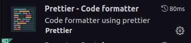

# Configuração ESLint/Prettier

Esse é um exemplo de configuração inicial do ESlint e Prettier da [Infojr]() pra projeto com React, Nextjs, Typescript, Jest e Styled-Component.

## Como fazer essa configuração:

Comece criando um [Create Next App](https://github.com/vercel/next.js/tree/canary/packages/create-next-app#readme)!

Em seu terminal, rode o comando:

```bash
npx create-next-app --example with-jest with-jest-app
```

Após isso, instale o [styled-component](https://styled-components.com/docs/basics#installation):

```bash
npm install --save styled-component
```

Coloque também a tipagem pra o [Styled-Component](https://styled-components.com/docs/api#typescript):

```bash
npm install --save-dev @types/styled-components
```

Instale o ESLint e as [configurações da Infojr](https://www.npmjs.com/package/eslint-config-infojr-ts):

```bash
# ESLint
npm install --save-dev eslint

# Configurações
npm i --save-dev eslint-config-infojr-ts
```

Por fim, baixe o Prettier e as [configurações da Infojr](https://www.npmjs.com/package/prettier-config-infojr):

```bash
# Prettier
npm install --save-dev prettier

# Configurações
npm install --save-dev prettier-config-infojr
```

Agora, se não tiver ainda no VSCode, baixe a extensão do ESLint e do Prettier:




Obs: o VSCode vai recomendar essas extensões ao clonar esse repositório.

#### Delete seu arquivo '.eslintrc.json'

Crie um arquivo '.eslintrc.js'e coloque nele:

```javascript
module.exports = {
  root: true,
  extends: ['infojr-ts/next'],
  // Option needed specially for monorepos where eslint doesn't know where to find tsconfig.json
  parserOptions: {
    project: 'tsconfig.json',
    tsconfigRootDir: __dirname
  },
  plugins: ['testing-library'],
  overrides: [
    // Only uses Testing Library lint rules in test files
    {
      files: ['**/__tests__/**/*.[jt]s?(x)', '**/?(*.)+(spec|test).[jt]s?(x)'],
      extends: ['plugin:testing-library/react']
    }
  ]
}
```

Crie um arquivo '.eslintignore' com:

```
/.eslintrc.js
```

Crie o arquivo '.prettierrc.json' com:

```json
"prettier-config-infojr"
```

No 'settings.json' do VSCode, coloque:

```json
"editor.defaultFormatter": "esbenp.prettier-vscode",
"[javascript]": {
  "editor.defaultFormatter": "esbenp.prettier-vscode"
},
"editor.formatOnSave": true,
"editor.codeActionsOnSave": {
"source.fixAll.eslint": true
},
"eslint.validate": ["javascript", "javascriptreact", "typescript", "typescriptreact"]
```

## Pra rodar os testes:

```bash
npm test
```
