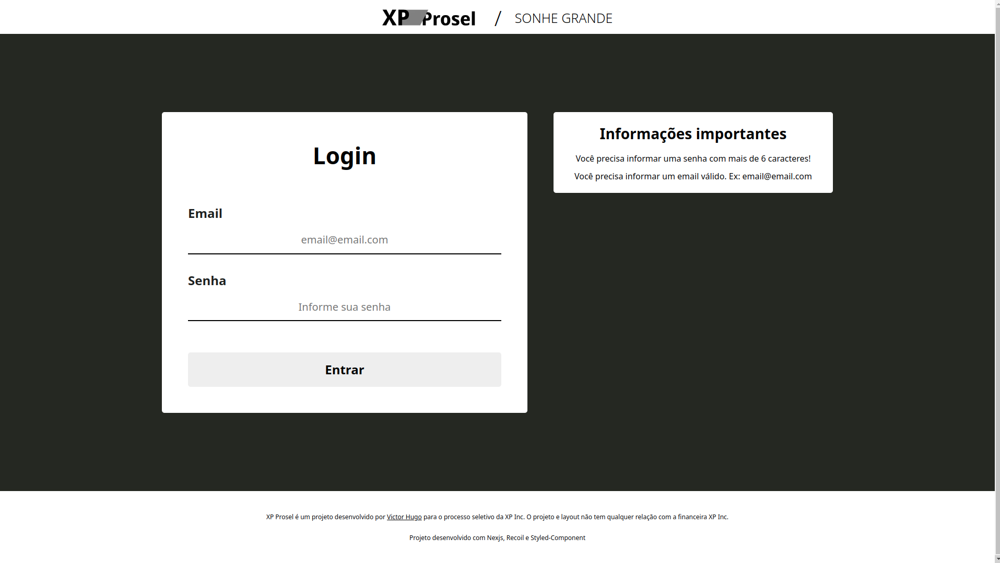
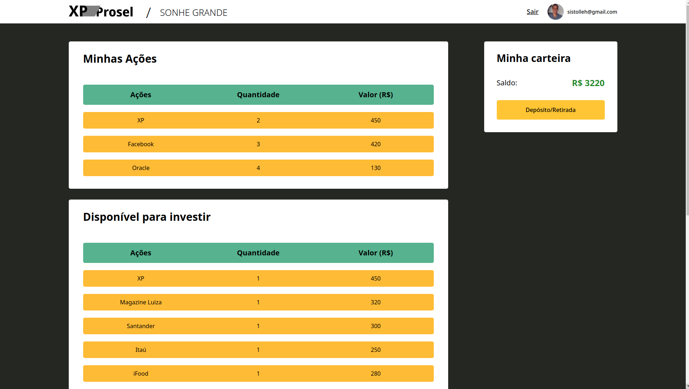
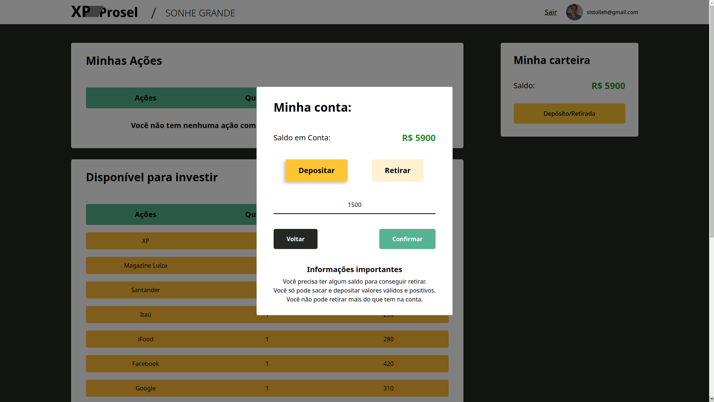
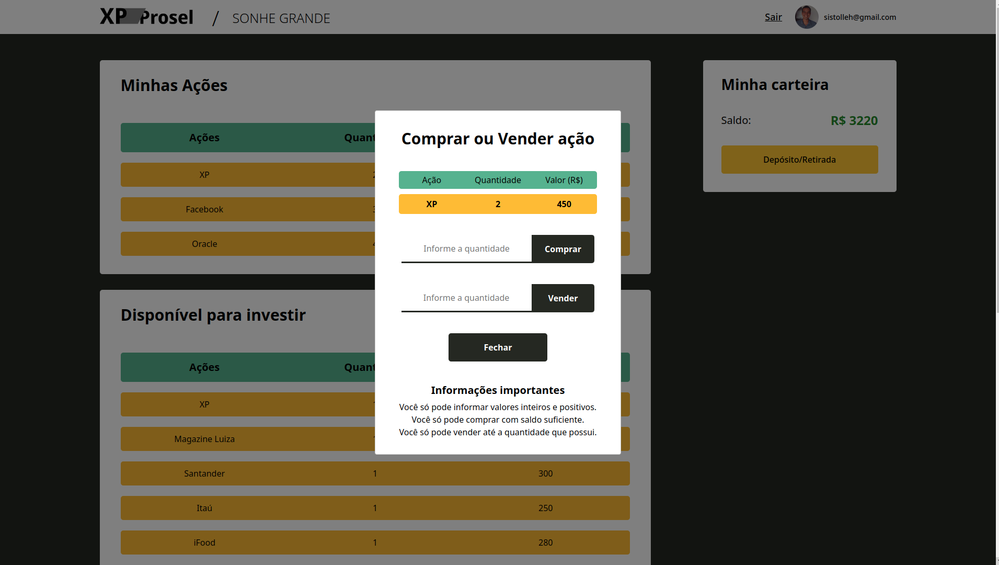
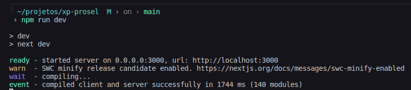
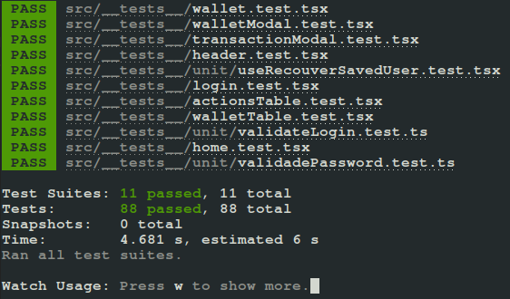
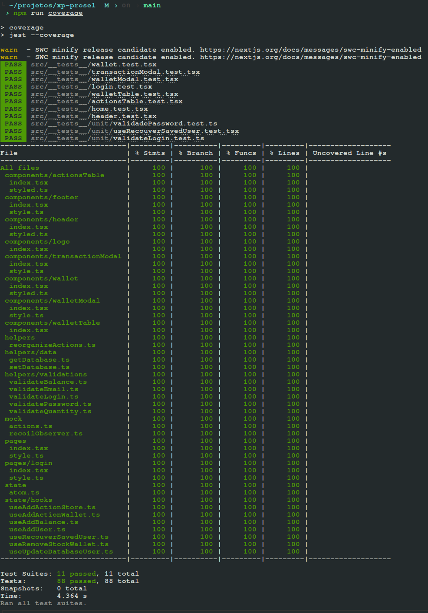

# Boas vindas ao repositório do projeto XP-Prosel

XP Prosel é um simulador de compra e venda de ações, com login e conta bancária. Na aplicação, é possível depositar um valor à sua escolha, comprar as ações disponíveis, vendê-las e retirar o saldo. Caso o navegador seja fechado ou o usuário faça logoff, as informações como saldo e ações compradas serão restauradas ao logar novamente.

XP Prosel foi uma aplicação feita para o desafio técnico da XP Inc para a Turma XP, da Trybe, para o cargo de desenvolvedor de nível júnior.

Para essa aplicação, foi usado Nextjs, Recoil, Styled-Component, Typescript e o Jest com React Testing Library (para desenvolvimento dos testes). XP Prosel não possui back-end e alguns dados de uso são armazenados no localStorage do seu navegador. Quase todas as features da aplicação foram feitas em TDD (Test-driven development).

O deploy de XP Prosel foi realizado na vercel e você pode encontrar a aplicação online em https://xp-prosel.vercel.app/

  
  
  
  

## Como rodar a aplicação

Você pode simplesmente acessar o deploy da aplicação [neste link](https://xp-prosel.vercel.app/) ou seguir às instruções abaixo:

  
<strong>👨‍💻 Baixando repositório e entrando na pasta</strong>
 

  Caso não possua o git instalado, você pode clicar em "Code" (em verde) no topo do repositório e depois em "Download Zip".
  
  Caso possua o git instalado, execute os comandos abaixo no bash (linux e mac) ou cmd/powershell (windows):

  - Clone o Repositório
    - em SSH: `git clone git@github.com:victorhsms/xp-prosel.git`.
    - ou em HTTPS: `https://github.com/victorhsms/xp-prosel.git`.
  
  - Entre na pasta do repositório que você acabou de clonar:
    - `cd xp-prosel`

  
<strong>🛠 Instalando dependências e executando aplicação</strong>
  

  Após projeto baixado e que você entrou na pasta, certifique-se que você tem a versão mais atualizada do [NodeJS LTS](https://nodejs.org/en/) (você pode verificar a versão instalada digitando `node --version` no bash ou powershell). 

Tendo certeza que está com a mais atualizada versão LTS do NodeJS instalado, execute as instruções abaixo no bash (linux e mac) ou cmd/powershell (windows):

 - Instale as dependências:
   - `npm install` ou `npm i`
 - Inicie a aplicação:
   - `npm run dev`

Em seu terminal, deve aparecer a seguinte informação:

Caso a porta 3000 já esteja ocupada e a url seja diferente de "http:localhost:3000", abra o código em algum editor de código de sua escolha e procure o seguinte arquivo: `./src/pages/index.tsx` e altere a linha 57 com a porta que o projeto foi executado e salve o arquivo. Exemplo:

 - Ele foi executado na porta 3001. Mude a linha para:
 - `const urlSearch = 'http://localhost:3001/api/actions'`

  
<strong>🧪 Rodando os testes</strong>
 

  O projeto possui 100% de cobertura de testes. Você pode executar os testes localmente, digitando no terminal o comando `npm test`.

  Deverá aparecer o log seguinte em seu terminal:

  

  Para ver a cobertura total dos testes, digite no terminal o comando `npm run coverage`.

  Deverá aparecer um relatório em seu terminal assim como esse:

  

## Maiores dificuldades

Minha maior dificuldade foi fazer o TDD. Eu sabia apenas o mínimo de jest e RTL e quase não tenho nada com testes no meu github. Além disso, eu também tive que aprender a testar funcionalidades do Nextjs e do Recoil. Eu passei várias horas de pesquisa e estudo e algumas vezes acabei tendo um feature aqui e alí que acabaram não sendo em TDD. Exemplo: Eu comecei a experimentar "será que daria pra criar algo assim" e acabou saindo algo que eu precisei criar os testes em seguida.

Por diversas vezes o Nextjs era um grande empecilho com o next, visto que, por exemplo, o jest não consegue reconhecer alguns hooks do Nextjs. Precisei baixar a biblioteca next-router-mock para mockar o useRouter,

O Nextjs, por diversas vezes, trouxe alguns bugs que precisei de bastante pesquisa para resolver, como, por exemplo, a renderização da estilização feita em servidor. Às vezes, a aplicação simplesmente ficava sem estilo, o que me forçava a fechar o servidor para voltar a funcionar.

No geral, a maior parte do desenvolvimento do projeto foi usada em pesquisas nas documentações e fóruns, resoluções de problemas e estruturação dos testes (visto que eu não sabia como testar algumas coisas). Coisas como o desenvolvimento de algumas novas features, estilização, documentação e, principalmente, o deploy foram as partes mais rápidas e tranquilas.
## Informações importantes

<strong>🤷 Por que essa stack?</strong>
  

Na [Trybe](https://www.betrybe.com/), aprendemos React (class component e function component), React-Router, Redux e bem pouco de Jest/RTL ao longo de todo o módulo de Front end.

Porém eu acredito que adotar essa stack para o desenvolvimento do desafio técnico era um caminho confortável e previsível. Eu queria ir mais distante e aproveitar a jornada de desenvolvimento dessa aplicação para aprender coisas novas também.

#### NextJS
Dito isso, eu resolvi usar o <strong>Nextjs</strong> por ser um framework popular com ferramentas de desenvolvimento poderosas e inovadoras (como o SSR e API), simples de ser usado e fazer deploy e que substitui completamente o uso do React-Router. Com o NextJs até foi possível  simular, minimamente, uma requisição de API. Já desenvolvi um projeto em Nextjs antes na [InfoJr](Ehttps://infojr.com.br/), empresa júnior que participo.

#### Recoil

Eu sempre considerei o Redux uma ferramenta muito útil e robusta, mas acredito que não é uma tecnologia para ser usada em aplicações tão pequenas. Além disso, usar o useContext do React seria simples demais, previsivel e um pouco problemático, devido a mudanças no estado renderizarem toda a página. O <strong>Recoil</strong> era um tecnologia que aprendi muito recentemente e o gerenciamento de estado atômico permite a re-renderização apenas dos componentes que usam aquele estado. 

Resolvi arriscar a esse ser meu primeiro projeto usando Recoil. Não me arrependo, foi extremamente simples de aprender, testar e desenvolver. Aprendi muito e desejo experimentar outras soluções de gerenciamento de estado atômico, como o [Jotai](https://jotai.org/).

#### Desenvolvimento por TDD (Jest / RTL)

Eu quase nunca usei testes além do que foi necessário e o pouco que usei foi pra um projeto na Trybe, o qual não tive um rendimento muito bom. Fiz em TDD porque acredito que é uma metodologia objetiva, segura e de boas práticas. Desenvolver em TDD me garantiu que eu fizesse refatorações constantes sem medo da minha aplicação quebrar.

#### Por que não criar uma API com banco de dados?

Essa era minha intenção inicial, mas acredito que para uma vaga de front end e mobile seria mais proveitoso usar o tempo disponível para aprender e desenvolver técnicas mais voltadas para o dia a dia de uma pessoa desenvolvedora em front/mobile. Com essa decisão eu acabei perdendo a oportunidade de trabalhar com async/await, porém ganhei tempo para me dedicar a aprender as novas tecnologias e fazer o TDD. Para criar um back-end também seria necessário me preocupar com questões como outros repositórios, configurações, stack do backend, garantir que ele esteja funcionando ou o front iria quebrar e etc.

#### Commits em Português

Eu escolhi fazer commits em português porque acreditei que seria mais fácil descrever o que fiz no commit e que outras pessoas que não são proficientes no inglês entendessem melhor. Porém eu acredito que isso mais me prejudicou do que ajudou, visto que eu já estava acostumado a fazer commits em inglês e por diversas vezes eu começava a digitar em inglês, lembrava do padrão e tinha que apagar.

#### ESLint e Prettier

Eu usei uma configuração de [ESLint](https://www.npmjs.com/package/eslint-config-infojr-ts) e [Prettier](https://www.npmjs.com/package/prettier-config-infojr) que são o padrão do desenvolvimento na InfoJr (empresa júnior da UFBA que participo). Como podem ver por commits iniciais, eu fiz um template de configuração para front-end com Nextjs, TS, Jest, Styled-Component, ESlint e Prettier a dois meses atrás, justamente para o desenvolvimento de projetos pessoas. O repositório dessa configuração é encontrado [NESTE LINK](https://github.com/victorhsms/eslint-prettier-config).

Porém, apesar do Prettier ter funcionado corretamente, eu acredito que aconteceu algum problema na configuração do ESLint e ele não funcionou. Como eu só notei isso quando a aplicação estava com o desenvolvimento avançado, resolvi ignorar esse fato e finalizar o projeto sem o ESLint.

<strong> 🌊 Fluxo da aplicação</strong>
  

Caso o cliente entre na página home e não esteja logado, ele é redirecionado à página '/login'. Um redirecionamento acontece ao tentar acessar a página de login quando já existe um usuário logado, o cliente é enviado para a página home. Dito isso, é válido informar que o usuário logado fica guardado no localStorage e só é deletado manualmente ou após dar Logoff na página home. 

Para logar, siga as instruções na página de login sobre informar um email válido e uma senha com mais de 6 caracteres (letras, números ou símbolos). Quando tudo for digitado corretamente, o botão de Entrar ficará habilitado para clicar.

Ao acessar a aplicação pela primeira vez, não será possível comprar uma ação até que seja inserido um saldo na carteira. O usuário pode clicar em Depósito/Retirada para Depositar ou Sacar um valor. 

Após clicar, abrirá um modal que vai permitir depósitos e retiradas. As retiradas só ficarão disponíveis quando houver algum saldo na conta. O Usuário poderá informar qualquer valor positivo e inteiro ou com ponto flutuante e clicar em confirmar. Só é possível retirar valores que estão disponíveis no saldo da conta, nada além.

Quando tiver um valor na conta, o usuário pode clicar em alguma ação e comprá-la. A ação irá para a lista de ações na carteira e, ao clicar nelas, o usuário poderá comprar mais (caso possua saldo para isso) ou vendê-las (somente a quantidade que ele possui) ao digitar um valor inteiro e positivo no input e confirmar.

<strong> ✨ Decisões sobre mockup e UX</strong>
  

Escolhi colocar uma logo semelhante a da XP Inc para apresentar o projeto e sua identidade visual. O tema e valor "Sonhe Grande" foi o mantra que me guiou durante o desenvolvimento. Um footer foi criado para descrição para apresentar o projeto e também se desvincular da XP Inc, devido à logo semelhante. Todas as escolhas de design foram baseadas no site da XP Inc, exceto alguns detalhes, como as bordas arredondadas e algumas cores.

Na página Home, o usuário poderá ver uma foto sua, caso o email informado seja vinculado a alguma imagem. Seu email também será exibido.

Decidi tentar manter o valor de saldo na carteira visível na maior parte do tempo, para que o usuário não tenha dificuldades. Também troquei a posição do botão de depositar/transferir para a carteira, acredito que faz mais sentido na usabilidade.

Decidi também que não seria necessário um botão de Compra/Venda, e adorei um layout mais limpo. Portanto, é necessário apenas clicar em qualquer local da ação para abrir um modal com informações sobre ela e permitir a compra/venda. Coloquei um hover para indicar a possibilidade de fazer isso e também um aviso indicativo quando a carteira de ações está vazia.

<strong> 💀 Problemas conhecidos</strong>

Aqui a lista de alguns problemas que notei e não tive tempo de resolver:

 - Quando um usuário logado acessa a página home e atualiza a página (pelo navegador ou apertando F5) as informações sobre saldo e ações compradas são perdidas do estado da aplicação.
   -  Além disso, na primeira ação após fazer o passo acima, os dados do usuário no localStorage são resetados.
 - Retirar todo o saldo da conta, abrir o modal de "depositar/retirar" faz com que seja necessário clicar novamente na opção de "Depositar" ou não acontecerá nada ao clicar em confirmar.
 - Vender apenas algumas quantidades de uma ação (não todas) não está atualizando o localStorage, o que faz com que o usuário perca essa informação caso não faça nenhuma outra transação antes de fechar a aplicação ou deslogar e atualizar a página.

<strong> 🔥 Melhorias futuras</strong>

Aqui a lista de algumas melhorias que gostaria de fazer a curto prazo:

 - Resolver os bugs conhecidos.
 - Retirar as informações importantes dos modais e da página de login e criar alertas que respondam ao erro do usuário.
 - Desenvolver uma forma de simular rendimentos e perdas nas ações do usuário
 - Criar uma API simples para alterar os dados de cada cliente e retirar a necessidade de usar o localStorage
 - Criar filtros para pesquisa de ações específicas por preço ou nome.
 - Desenvolver uma lista de "usuários logados recentemente" na página de login

